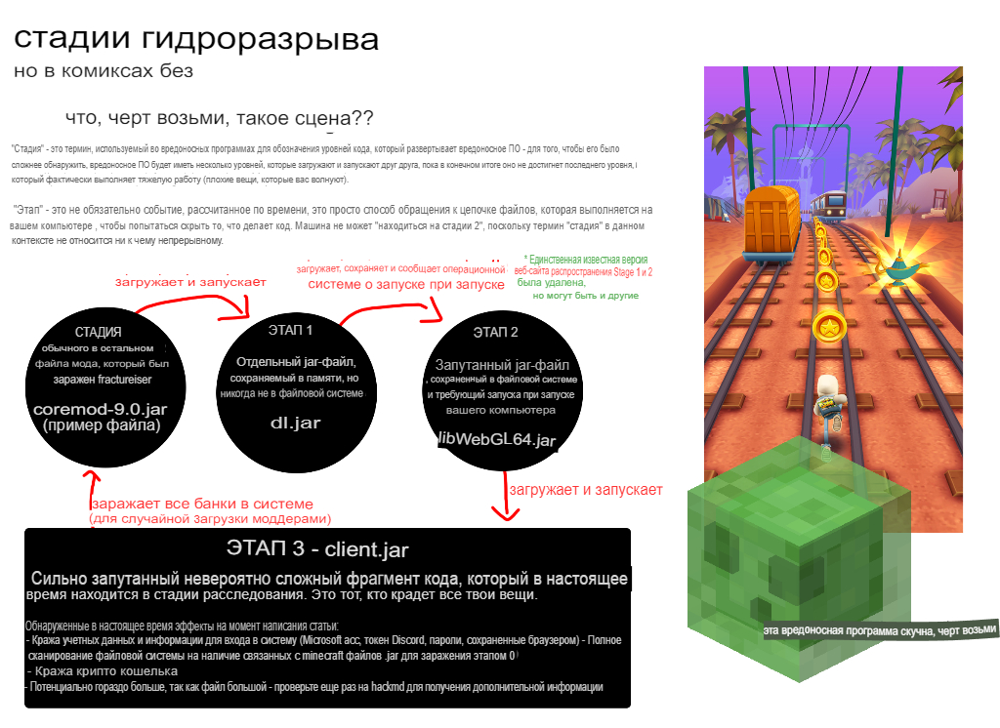

# Руководство для игроков с модами

Если вы **только** играете в ваниль через доверенный лаунчер, такую как официальная программа запуска или
Prism, и никогда не прикасались к модам: вы на 100% в безопасности. Держитесь подальше от модов для
время.

Если вы играете в майнкрафт с модами, вам необходимо проверить, не заразились ли вы
Вредоносным ПО Fractureiser, чтобы гарантировать, что ваша машина и личные данные не находятся под угрозой. Ты можешь сделать
это с помощью инструкций ниже.

### Это все еще продолжается??
**Нет. Ну вроде.**
На данный момент, с нашими текущими знаниями, мы считаем, что вирус «fractureiser» полностью очищен.
из текущих общедоступных модов (пакетов).

Наша текущая рекомендация заключается в том, что игроки, которые запустили средство проверки ступени 2 на этой странице, могут безопасно продолжать играть, однако, поскольку загрузки модов были возвращены в онлайн как на CurseForge, так и на Modrinth, теперь у авторов вредоносных программ-подражателей есть возможность создавать новые вирусы.

Мы находимся в контакте со всеми соответствующими сторонами для установления протоколов, чтобы этого не произошло.
в будущем.

Если вы хотите играть, выполните диагностические шаги на этой странице, а также выполните следующие действия.
разделы о том, что делать, если вы инфицированы или не инфицированы.

### Структура страницы
* [Что на самом деле произошло?](#%D1%87%D1%82%D0%BE-%D0%BD%D0%B0-%D1%81%D0%B0%D0%BC%D0%BE%D0%BC-%D0%B4%D0%B5%D0%BB%D0%B5-%D0%BF%D1%80%D0%BE%D0%B8%D0%B7%D0%BE%D1%88%D0%BB%D0%BE)
* [Я заражен?](#%D1%8F-%D0%B7%D0%B0%D1%80%D0%B0%D0%B6%D0%B5%D0%BD)
* [Я заражен, что теперь?](#%D1%8F-%D0%B7%D0%B0%D1%80%D0%B0%D0%B6%D0%B5%D0%BD-%D1%87%D1%82%D0%BE-%D1%82%D0%B5%D0%BF%D0%B5%D1%80%D1%8C)
* [Я не заражен, что теперь?](#%D1%8F-%D0%BD%D0%B5-%D0%B7%D0%B0%D1%80%D0%B0%D0%B6%D0%B5%D0%BD-%D1%87%D1%82%D0%BE-%D1%82%D0%B5%D0%BF%D0%B5%D1%80%D1%8C)
* [Часто задаваемые вопросы](#%D1%87%D0%B0%D1%81%D1%82%D0%BE-%D0%B7%D0%B0%D0%B4%D0%B0%D0%B2%D0%B0%D0%B5%D0%BC%D1%8B%D0%B5-%D0%B2%D0%BE%D0%BF%D1%80%D0%BE%D1%81%D1%8B)
* [Часто задаваемые вопросы по техническим вопросам](#%D1%82%D0%B5%D1%85%D0%BD%D0%B8%D1%87%D0%B5%D1%81%D0%BA%D0%B8%D0%B9-faq)

Если у вас есть какие-либо вопросы о дробильщике, пожалуйста, прочитайте эту страницу полностью, включая часто задаваемые вопросы по адресу
конец, так как здесь есть ответы на большинство вопросов, которые мы получаем.

## Что на самом деле произошло?

Несколько невинно выглядящих вредоносных модов и плагинов изначально были загружены создателем вредоносного ПО.
на сайт хостинга модов CurseForge и хаб плагинов dev.craftbukkit.org (не Bukkit
само программное обеспечение). Известный разработчик пакетов модов загрузил один из этих модов, чтобы попробовать
out, которые заразили файлы на своем компьютере без их ведома, включая копию
рабочий проект, который затем будет загружен в CurseForge как законный файл, с
вирус в комплекте.

Затем этот процесс повторился для нескольких других случаев от пользователей на CurseForge и
dev.craftbukkit.org, заражая копии нескольких популярных плагинов и модов. *Есть сообщения о
вредоносные плагины и моды jars как раньше
как середина апреля.*

Наряду с этим автором вредоносного ПО были предприняты попытки грубой силы доступа к учетным записям создателей контента с высоким трафиком на CurseForge. В настоящее время мы не уверены, произошло ли нарушение из-за попытки грубой силы или из-за троянского заражения владельцев учетных записей.

Это вредоносное ПО состоит из нескольких «стадий», каждая из которых отвечает за загрузку и запуск следующей. Всего существует три известных этапа (этапы 1, 2 и 3), причем зараженные файлы модов служат «этапом 0», запускающим весь процесс.

Этап 3 является «вдохновителем» вредоносной программы, и у нас есть доказательства того, что она пытается сделать все из следующего:

* Распространяется на *все* `jar` файлы в файловой системе, возможно, заражая моды, которые не были загружены из CurseForge или BukkitDev, или других программ Java
* Украсть файлы cookie и данные для входа во многие веб-браузеры
* Замените криптовалютные адреса в буфере обмена на альтернативные, которые предположительно принадлежат злоумышленнику.
* Украсть учетные данные Discord
* Украсть учетные данные Microsoft и Minecraft

(См. [технические детали](tech.md) для получения дополнительной информации)

Из-за его поведения мы **полностью уверены**, что это **целевая атака на модифицированную экосистему Minecraft**. Это очень плохо.

**До дальнейшего уведомления, будьте предельно осторожны с загрузками модов Minecraft, независимо от их происхождения.** Хотя управляющий сервер для этой вредоносной программы в настоящее время отключен, **любая загрузка из Curseforge или репозитория плагинов Bukkit за последние 2-3 недели должна рассматриваться как потенциально вредоносные**. Некоторые сканеры вредоносных программ начали добавлять сигнатуры в свои базы данных, но пока это не будет распространено на все из них, будьте осторожны.

*На данный момент мы не можем быть уверены, что никакие услуги хостинга не затронуты*. Пожалуйста, соблюдайте осторожность независимо от того, какой сайт вы используете. Даже репозитории Maven могут быть заражены, а эта вредоносная программа существует уже несколько месяцев.

В настоящее время новые заражения невозможны, так как сервер злоумышленника отключен, существующие инфекции могут быть активны.

<!--### Перейдем к делу, как мне это исправить?

 -->

### Подождите, что за хрень такая "ступень"?



## Я заражен?

Вредоносное ПО имеет несколько стадий, поэтому вопрос о том, заражены ли вы, на самом деле состоит из двух вопросов.

### Имеют ли какие-либо файлы моих модов стадию 0?
Существует множество сканеров, которые берут файл мода и определяют, заражен ли он этапом 0 вредоносного ПО.

* [сканер] Overwolf (https://github.com/overwolf/jar-infection Scanner/releases) * Это рекомендуемый вариант для проверки всей игры — просто укажите его в папке установки CurseForge или в любом другом месте, где у вас есть экземпляры. сохранен
   * Это отдельная программа, не требующая установки приложения Overwolf.
* douira [онлайн-сканер на основе веб-сайта] (https://douira.github.io/fractureiser-web-detector/)
* [nekodetector] cortex (https://github.com/MCRcortex/nekodetector/releases)
   * Нажмите «Активы», чтобы отобразить исполняемый файл — требуется установленная Java.

В отдельности заражение стадии 0 не опасно, если файлы удалены и никогда не запускались.

### Имеются ли в моей системе файлы Stage 2?

Наличие файлов этапа 2 в вашей системе означает, что этапы 0 и 1 вредоносного ПО запустились успешно.
Если они вообще присутствуют, вы, вероятно, *полностью заражены* и должны продолжить чтение инструкций в документе.

Многие антивирусные сканеры начинают обнаруживать файлы стадии 2. Если вы получили предупреждение о том, что такие файлы были найдены и удалены, перейдите к пункту «Я заражен, что дальше?» раздел.

В противном случае вы можете проверить вручную, выполнив следующие действия в зависимости от вашей платформы:

#### Инструкции для Windows

* Откройте меню «Пуск» с помощью ключа Windows и введите «%localappdata%» — должно появиться следующее: 

* В папке Local appdata вы должны убедиться, что ваш проводник настроен на просмотр обоих
«Скрытые элементы» и «Защищенные файлы операционной системы».
   * Это можно сделать в меню Вид > Параметры
   * Если вы не знаете, как это сделать, видео-объяснение [можно найти здесь] (https://youtu.be/KLTlTlnXeKs).
   * Пользователи Windows 11 могут найти те же параметры под кнопкой «Просмотр» на верхней ленте, а также с помощью кнопки «...» в самой правой части ленты.

* Найдите папку с именем «Microsoft Edge». ПРОБЕЛ между «Microsoft» и «Edge» важен, поскольку «MicrosoftEdge» — это законная папка, используемая Edge. Вирус просто назвал его так, чтобы замаскироваться.
   * Допустимая папка также может называться Microsoft\Edge (папка Edge внутри папки Microsoft).
   * Легальная папка не *должна* существовать — если у вас нет папок, связанных с Edge, вы в безопасности.
   * Обе законные папки могут существовать одновременно, это тоже нормально.
* Если `Microsoft Edge` присутствует, вы были заражены. Если это так, навсегда удалите папку и все, что в ней находится.
   * Если папку нельзя удалить, вы должны остановить все программы Java, работающие в данный момент, через диспетчер задач.

#### Информация о MacOS

Вредоносная программа, похоже, не влияет на MacOS, так что все должно быть в порядке.
*На всякий случай заглядывайте сюда время от времени.*

#### Инструкции для Linux

Во-первых, убедитесь, что любой метод, который вы используете для вывода списка файлов, позволяет просматривать скрытые файлы.
Большинство файловых менеджеров с графическим интерфейсом имеют сочетание клавиш Ctrl+H для переключения скрытых файлов. Если вы делаете это на терминале, используйте «ls -A» в соответствующих каталогах или «ls -lha» для получения более подробного списка.

Если какой-либо из следующих файлов существует, вы были заражены. Если это так, удалите их все:
* `~/.config/systemd/user/systemd-utility.service`
* `/etc/systemd/system/systemd-utility.service`
* `~/.config/.data/lib.jar`

После этого, если это применимо, проверьте свой `journalctl` на наличие изменений, которые вы можете не распознать. Вы можете сделать это с помощью команд `journalctl -exb` (для системных журналов) и `journalctl -exb --user` (для пользовательских журналов). Выполните следующие команды, чтобы обновить службы systemd:
```sh
sudo systemctl daemon-reload # Введите пароль пользователя
systemctl --user демон-перезагрузка
```

#### Скрипты

*Если вы не знаете, как запустить скрипт PowerShell или Bash, это не для вас.*
Автоматизированные сценарии PowerShell или Bash также доступны [на веб-сайте PrismLauncher] (https://prismlauncher.org/news/cf-compromised-alert/#automated-script), чтобы проверить этап 2, если у вас есть технические ноу-хау. запустить их. Overwolf (материнская компания Curseforge) также выпустила инструмент обнаружения C# Stage 2: https://github.com/princessmortix/defractureiser.

## Я заражен, что теперь?

**ВАЖНО**: В настоящее время мы не знаем ни всего, что это может сделать, ни его намерений, поэтому следует проявлять крайнюю осторожность, пока не будет найден полный способ устранения каких-либо симптомов. Все изложенное здесь — это только *то, что нам известно* — пожалуйста, следите за сообщениями команды об обновлениях, если будет обнаружено что-то критическое.

Если вы обнаружите в своей системе файлы этапа 2 от fraciser, весьма вероятно, что код этапа 3 был запущен и заразил вашу машину.
Теперь вам лучше всего предположить, что все в этой системе *полностью скомпрометировано*. Вам следует:

* Сделайте резервную копию всего, что вы не хотите потерять, на флэш-накопитель или внешний диск (в любом случае вы должны делать это регулярно!)
* Используя отдельное устройство, измените пароли ко всем сервисам, в которые вы вошли на старой машине (Discord, электронная почта и т. д.). Желательно использовать менеджер паролей, например [BitWarden](https://bitwarden.com).
* Если вы еще не использовали двухфакторную аутентификацию (приложение для аутентификации или SMS) для каждой службы, которая ее поддерживает, немедленно начните это делать.
* Если у вас есть возможность, обратитесь в профессиональную службу в вашем регионе, чтобы провести надлежащую диагностику вашего компьютера на предмет чего-либо подозрительного, или в качестве безопасного по умолчанию просто очистите и переустановите систему.
* Прочтите приведенный ниже раздел о том, что делать, если вы не заражены, так как приведенные здесь шаги относятся и к вам.

## Я не заражен, что теперь?

Если детектор этапа 2 ничего не нашел, скорее всего, ничего не происходит, и вы можете играть.

Хотя «фрактурайзер» был очищен, в ближайшем будущем могут появиться новые вирусы, пока мы не установим новые протоколы. Если вы хотите играть в игру, мы рекомендуем:

* Играйте исключительно в моды и пакеты модов, которые вы уже загрузили и проверили на безопасность.
* Избегайте загрузки чего-либо, загруженного после 8 июня от новых или неизвестных авторов, по той же причине, что и в предыдущем пункте.
* Избегайте обновления ваших модов (пакетов).
* Следите за сообщениями команды о разработках новых методов обнаружения подобных проблем в будущем.

## Часто задаваемые вопросы

### CurseForge взломан?
Сам CurseForge не скомпрометирован, только отдельные пользователи. Это не проблема CurseForge, они просто оказались там, где это произошло. CurseForge также [опубликовали статью] (https://support.curseforge.com/en/support/solutions/articles/9000228509-june-2023 -infected-mods-detection-tool/) описывают ситуацию со своей стороны и работают над развертыванием контрмер.

### С Модринтом все в порядке?
Modrinth провел полное сканирование загрузок за последние 10 месяцев и не обнаружил ни одного зараженного проекта.
Мы по-прежнему рекомендуем проявлять крайнюю осторожность при загрузке любых модов, связанных в данный момент.
Тот факт, что никакие моды не были заражены, был полной удачей.

### Модринт безопаснее?
Это не проблема уровня веб-сайта, Modrinth так же безопасен, как и CurseForge.

### Как CurseForge пропустил это?
Код, запущенный заражением стадии 0, не обязательно был подозрительным для автоматизированной системы и вполне мог быть чем-то, что использовал бы другой мод. Фактически, ранние эвристики для определения заражения на стадии 0 имели значительное количество ложных флагов в популярных модах, таких как Quark.

На самом деле, этот тип предотвращения в масштабе платформы неосуществим из-за бесконечного количества различных способов, которыми вы можете разместить код, чтобы скрыть свои намерения.

### Какие антивирусы это ловят?
Пока мы говорим, добавляются новые, лучше всего выполнить ручную проверку, описанную выше, вместо того, чтобы пока полагаться на AV.

### Безопасен ли многопользовательский режим?
Да, вы не можете заразиться через многопользовательский сервер, если вы не скачаете моды для него в другом месте.

### Бедрок безопасен?
Да, это касается только Java.

### Безопасны ли альтернативные игровые клиенты, такие как Lunar или Badlion?
См. пункт ниже.

### Безопасен ли Optifine? / Безопасен ли натрий? / Айрис в безопасности? / Безопасно ли создавать? / Является ли Essential безопасным? / Безопасен ли (вставьте мод)?

**В настоящее время мы не можем полностью подтвердить безопасность того или иного мода.**

Одной из функций вируса стадии 3 является заражение как можно большего количества файлов .jar на вашем компьютере. Он может заражать **все файлы .jar**, включая сам Minecraft (ванильный/модифицированный), моды Minecraft, плагины Spigot и несвязанные Java-приложения. Поэтому, если на вашем компьютере есть часть вируса стадии 3, не имеет значения, является ли мод, который вы загружаете, «безопасным» - он *заразится*.
Обнаружение и удаление более поздних стадий гидроразрыва *сначала*.

На данный момент все *известные* зараженные моды удалены из CurseForge. CurseForge [опубликовал список известных зараженных модов](https://support.curseforge.com/en/support/solutions/articles/9000228509-june-2023-infected-mods-detection-tool/) (внизу страницы) и удалил их с сайта. Modrinth просканировал 10 месяцев назад и не нашел зараженных модов.

Это *не гарантирует, что ни один трус не проскользнет*. Чтобы проверить, содержит ли данная банка 0-й этап разлома, проверьте раздел [Я заражен?] (#am-i-infected) и в целом проявляйте крайнюю осторожность, загружая все, что связано с модами на данный момент.

### Насколько широко распространилась инфекция?

CurseForge сообщает, что зараженные файлы были загружены примерно 6000 раз за весь период заражения. Цитата из объявления CF в Discord:
> Для сравнения: это составляет около 0,015% ежедневных загрузок CurseForge.
> для майнкрафта.

### Кто-то хотел испортить событие выпуска 1.20?

Это похоже на совпадение — эта вредоносная кампания была активной в течение достаточно долгого времени, прежде чем была широко раскрыта утром в выпуске 1.20.

## Технический FAQ

### Может ли дробилка обойти ВМ (виртуальные машины)?

**Нет.**

stage3 *содержит* код для *попытки* *ручного* выхода из ["песочницы Windows"](https://learn.microsoft.com/en-us/windows/security/application-security/application-isolation/ windows-sandbox/windows-sandbox-обзор).
Это не происходит автоматически. Если вирус запускается из песочницы Windows, он попытается возиться с буфером обмена, чтобы заставить вас вставить ярлык вредоносной программы.

Обратите внимание, что в этом виде «побега из буфера обмена» нет ничего нового, и его очень легко победить, просто не разделяя буфер обмена между хостом и гостевой ОС. Используйте более тяжелую виртуальную машину, чем «песочница Windows», и отключите такие функции, как «гостевые надстройки» VirtualBox или «службы интеграции» Hyper-V.

(*Настоящие* эксплойты для побега на виртуальных машинах стоят миллионы долларов и не будут сожжены на некоторых детях Minecraft, и у нас есть основания полагать, что автор этой вредоносной программы вообще не очень хороший программист.)

### Распространяется ли это по сети?

Насколько нам известно, fraciser не содержит функционала сетевого распространения, но это не исключено полностью.
Исследователь безопасности, с которым мы работаем, получил предупреждение, но в итоге оно касалось совершенно не связанного с ним вредоносного ПО, которое использовало похожее имя файла. Это была просто ложная тревога.

### Что с этим делают CurseForge и Modrinth?

CurseForge разработала [инструмент обнаружения stage2/3] с открытым исходным кодом (https://github.com/overwolf/detection-tool) и [инструмент обнаружения stage0] (https://github.com/overwolf/jar-infection- сканер), просканировал *все* загруженные моды/плагины на наличие инфекций stage0 и удалил все *известные* случаи заражения.

Modrinth также просканировал загруженные моды/плагины на наличие заражений stage0 за последние 10 месяцев и ничего не нашел.

Обе платформы рассматривают возможность введения своего рода автоматизированного процесса «сканирования на вирусы» в конвейер отправки модов. Это сложно, поскольку вредоносное ПО Java, подобное этому, обычно создается на заказ.

### Какие IP-адреса и URL-адреса следует заблокировать в моем брандмауэре/таблице маршрутизации?

Было замечено, что код, связанный с фракционером, подключается к этим URL-адресам и адресам через самые разные номера портов.

* Жестко запрограммированный адрес в модах, зараженных stage0, и первый обнаруженный сервер управления и контроля: `85.217.144.130`
* Второй наблюдаемый сервер управления и контроля: `107.189.3.101`
* Резервный URL-адрес, который пытается использовать stage1, и имя хоста команды и управления stage2: `files-8ie.pages.dev`

Также есть доказательства того, что он пытается подключиться к хосту `v2202209151437200088` через порт 25575 - неизвестные причины; вероятно, из-за более старой версии вредоносного ПО.

Вот несколько дополнительных адресов к брандмауэру, связанных со скайрейджем (опять же, *очень* маловероятно, что скайрейдж был загружен на чей-то компьютер через этот вектор, но все равно ничего хорошего с этих адресов не выйдет):

* `95.214.27.172`
* `connect.skyrage.de`
* `t23e7v6uz8idz87ehugwq.skyrage.de`
* `qw3e1ee12e9hzheu9h1912hew1sh12uw9.skyrage.de`
* *Возможно, просто честно заблокируйте весь `skyrage.de`*

Само собой разумеется, что вы не должны посещать их.

### Можем ли мы сделать это против правил CurseForge/Modrinth, чтобы ваш мод загружал другие файлы?

Загружать вредоносное ПО уже запрещено правилами CurseForge. Есть также много законных вариантов использования мода для загрузки файлов, которые это также задушило бы.

### Можно ли включить какой-нибудь "антивирус" или "песочницу" в сам загрузчик модов?

«Антивирус»: Вероятно, нет, по тем же причинам, по которым его не обнаруживали обычные антивирусы. Антивирусы могут обнаруживать только известные вредоносные программы, а не неизвестные вредоносные программы.

Песочница: в том числе какой-то «содержит ли этот класс« безопасный »код?» проверка перед загрузкой класса — отличный способ подстегнуть игру в кошки-мышки между разработчиками вредоносных программ и разработчиками загрузчиков модов.

Очень сложно запретить Java-коду использовать определенный класс (скажем, `URLClassLoader`), потому что вы также можете ссылаться на него с помощью `Class.forName` (который имеет массу законных вариантов использования), и если вы запретите или запретите -list классы из *этого*, вы обычно можете найти что-то *еще* в пути к классам, готовое вызвать `Class.forName` для вас, и попытка избавиться от этих гаджетов является бесконечной игрой в кротовину.

Песочница Java практически невозможна — см. такие статьи, как ["Двадцать лет выхода из песочницы Java"](https://www.exploit-db.com/papers/45517).

Java-моды — это просто пакеты произвольного кода: относитесь к ним как к `.exe`, они могут делать все что угодно.

### Почему моды не подписаны криптографически, чтобы предотвратить их вмешательство вредоносным ПО?

Часть проблемы заключается в том, что сами по себе подписи не защищают от вредоносного ПО — вирус с криптографической подписью остается вирусом — и если самоподпись разрешена, это также не предотвращает подделку — вирус может просто удалить цифровые подписи. jar («удалить META-INF») и переподписать его собственным ключом. (Это также не гипотетически: fraciser действительно содержит код для удаления цифровых подписей из банок, которые он заражает.)

Подписанные моды с онлайн-проверкой подписи *действительно* кажутся несколько многообещающим путем, хотя и не без компромиссов. Будет [встреча](2023-06-08-meeting.md) с множеством представителей экосистемы моддинга, чтобы обсудить, как двигаться дальше.

### Можно ли запретить модам скачивать исполняемый код?

Это невозможно. Вы не можете знать, содержит ли файл исполняемый код, до его загрузки, а после загрузки файла вы не можете контролировать, что с ним делается.

* Что делать, если мой мод загружает один файл класса Java?
* Как насчет файла класса Java, написанного задом наперед, чтобы сначала он не выглядел как файл класса?
* Как насчет файла класса Java, но зашифрованного?
* А как насчет *исходного* кода Java, скомпилированного на вашем компьютере?
* Как насчет скрипта Python?
* А как насчет файла, содержащего английскую прозу, где так уж получилось, что предложения с четным количеством слов соответствуют 0, а предложения с нечетным количеством слов соответствуют 1? - даже несмотря на то, что это прозаический документ, технически я могу собрать его в `.exe`, если захочу.

### Связано ли это с вредоносным ПО плагина Spigot?

Возможно! Есть некоторые связи с существующим вредоносным ПО «skyrage» — автор вредоносного ПО загрузил файл «.jar», относящийся к Skyrage, на свой резервный сервер управления и контроля в безуспешной попытке расширить атаку, незадолго до того, как CloudFlare все равно его уничтожил.

**Мы не получали никаких сообщений о том, что кто-то заразился Skyrage через этот вектор.**
Автор обновил URL-адрес CloudFlare, чтобы он указывал на Skyrage через значительный промежуток времени *после* того, как жестко запрограммированный IP-адрес в модах, зараженных stage0, уже был удален. Забавно, что нападавший вообще пытался подать эту банку.

Skyrage — это существующее, хорошо изученное вредоносное ПО, и вы можете найти дополнительную информацию о нем [здесь] (https://ljskatt.no/analysis/updater_class/).
